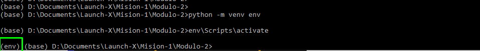
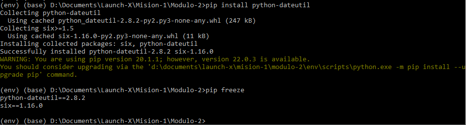
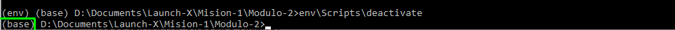

# Kata Módulo 02

## Ejercicio - Crear un paquete

### Crear un entorno virtual

* En la terminal se accede a la ruta donde se desea realizar el paquete y se ejecuta el comando `python -m venv env`. Posteriormente se realiza la activación del entorno virtual como se muestra

* Mediante el comando `pip freeze` se visualizan las bibliotecas instaladas en el ambiente, en este caso no existe ninguna

* Se realiza la instalación de la biblioteca dateutil y a continuación se vuelven a comprobar las bibliotecas instaladas en el ambiente

### Desactivar un entorno virtual

* Se realiza la desactivación del entorno virtual en el que se estaba trabajando

